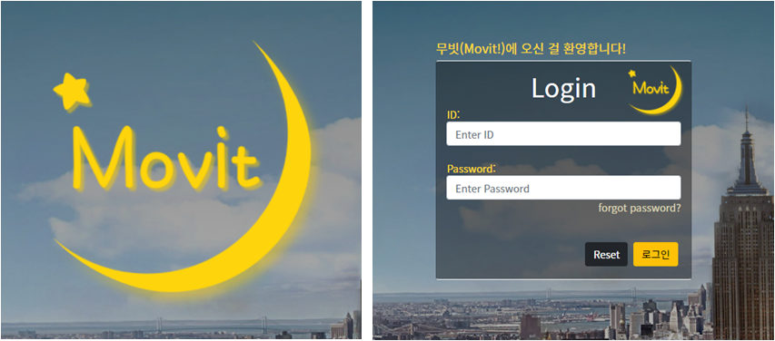

# README

## 1. 팀원 정보 및 업무 분담 내역

1. 팀원 정보 및 업무 분담내역

- 백엔드 | 정종우
- 프론트엔드 | 남하은

<br>

## 2. 목표 서비스 구현 및 실제 구현 정도

**목표 : 영화 데이터 기반의 정보 제공 사이트**

기본적인 영화 정보 조회, 좋아요, 영화 댓글 평점

커뮤니티,  마이페이지(나의 리뷰 조회, 좋아한 영화 조회) 기능을 함께 구현

유튜브 API를 활용한 트레일러 제공

실제 웹사이트에 비견될 수 있는 완성도를 갖추기 위한 CSS 기능 구현

3d-carousel 활용으로 입체적인 이미지의 영화 포스터 정보 제공

~~영화 검색 기능~~

<br>

## 3. 데이터베이스 모델링 ERD


<br>

### URL


<br>

<br>

## 4. 필수 기능에 대한 설명

### TMDB API를 사용한 영화데이터 크롤링

- 영화 데이터 : 약 1800개

```python
import requests
import json

idx = 1
ret = []
for page in range(1, 100):
    url = "https://api.themoviedb.org/3/movie/popular?api_key=1b7edbdee7b82ec37e80ba4d2b36db68&language=ko-KR&page=" + str(page)
    res = requests.get(url)
    res = res.json()
    movies = res["results"]

    for movie in movies:
        # 포스터가 없는 영화 데이터
        if not movie["poster_path"] or not movie['title'] or not movie['overview'] or not movie['release_date'] or not movie['vote_count'] or not movie['genre_ids']:
            continue
        inner = dict()
        inner['model'] = "movies.movie"
        inner['pk'] = idx
        idx += 1
        temp = dict()
        temp['title'] = movie['title']
        temp['overview'] = movie['overview']
        temp['release_date'] = movie['release_date']
        temp['vote_average'] = movie['vote_average']
        temp['poster_path'] = movie['poster_path']
        # genres = movie['genre_ids']
        # genreIds = ','.join(list(map(str, genres)))
        temp['genres'] = movie['genre_ids']
        inner['fields'] = temp
        ret.append(inner)
	   
    file = open("moviedata.json", "w+")
    file.write(json.dumps(ret))
```

<br>

### 관리자인 경우 영화 등록, 수정, 삭제 + 유저 관리

admin 등록

<br>

### 유저 회원가입 / 로그인 / 로그아웃

: 회원가입


```python
@api_view(['POST'])
def signup(request):
	#1-1. Client에서 온 데이터를 받아서
    password = request.data.get('password')
    password_confirmation = request.data.get('passwordConfirmation')
		
	#1-2. 패스워드 일치 여부 체크
    if password != password_confirmation:
        return Response({'error': '비밀번호가 일치하지 않습니다.'}, status=status.HTTP_400_BAD_REQUEST)
		
	#2. UserSerializer를 통해 데이터 직렬화
    serializer = UserSerializer(data=request.data)
    
	#3. validation 작업 진행 -> password도 같이 직렬화 진행
    if serializer.is_valid(raise_exception=True):
        user = serializer.save()
        #4. 비밀번호 해싱 후 
        user.set_password(request.data.get('password'))
        user.save()
        # password는 직렬화 과정에는 포함 되지만 → 표현(response)할 때는 나타나지 않는다.
        return Response(serializer.data, status=status.HTTP_201_CREATED)
```

<br>

:로그인

- jwt 토큰 사용
- transition 애니메이션 효과로 로고를 먼저 보여준 후, mouseover시 로그인 폼이 나오도록 구성



```python
from rest_framework_jwt.views import obtain_jwt_token
path('login/', obtain_jwt_token),
```

:로그아웃

- vue에서 jwt 토큰 지우도록함
- 오른쪽 상단의 사이드바에서 관리
- 버튼 mouseover시 네온 효과


<br>

### 영화 추천 기능

: 유저가 좋아요 한 영화 중 가장 빈번한 장르의 영화를 추천함.

- 유저 좋아요가 없을 경우, 평점이 높은 순으로 보여줌.


```python
@api_view(['GET'])
@authentication_classes([JSONWebTokenAuthentication])
@permission_classes([IsAuthenticated])
def MovieRecommend(request):
    if request.user.liked_movie.all():
        genre_cnt = dict()
        movies = request.user.liked_movie.all()
        for movie in movies:
            genres = movie.genres.all()
            for genre in genres:
                genre_cnt[genre.pk] = genre_cnt.get(genre.pk, 0) + 1
        favor_genre = sorted(genre_cnt.items(), key=lambda x : x[1], reverse=True)[0][0]
        movies = list(Movie.objects.filter(genres=favor_genre).all())
    else:
        movies = list(Movie.objects.filter(vote_average__gte=7).all())
    movie = sample(movies,15)
    serializer = MovieSerializer(movie, many=True)
    return Response(serializer.data)
```

<br>

### 영화 상세정보 조회

- 영화 포스터 클릭 이벤트 발생 시 영화 상세 정보를 담은 모달을 보여줌
- 하트를 누르면 내 영화 리스트에 담게 되고 마이페이지에서 좋아한 영화 조회 가능
- 영화마다 별점과 한 줄평을 남길 수 있음
- 유튜브 API를 통해 트레일러를 가져와 보여줌


```python
@api_view(['POST'])
@authentication_classes([JSONWebTokenAuthentication])
@permission_classes([IsAuthenticated])
def like(request, movie_pk):
    movie = get_object_or_404(Movie, pk=movie_pk)
    print(movie.like.all())
    if request.user in movie.like.all():
        movie.like.remove(request.user)
    else:
        movie.like.add(request.user)
    serializer = MovieDetailSerializer(movie)
    return Response(serializer.data)
```

<br>

### 게시글 조회, 생성, 수정, 삭제


Community → [views.py](http://views.py) 참고

<br>

### 댓글 생성 / 삭제

```python
@api_view(['POST'])
@authentication_classes([JSONWebTokenAuthentication])
@permission_classes([IsAuthenticated])
def comment_create(request, movie_pk):
    movie = get_object_or_404(Movie, pk=movie_pk)
    serializer = CommentSerializer(data=request.data)
    if serializer.is_valid(raise_exception=True):
        serializer.save(user=request.user, movie=movie)
        return Response(serializer.data, status=status.HTTP_201_CREATED)

@api_view(['DELETE'])
@authentication_classes([JSONWebTokenAuthentication])
@permission_classes([IsAuthenticated])
def comment_delete(request, movie_pk, comment_pk):
    if not request.user.movie_comments.filter(pk=comment_pk).exists():
        return Response({'detail': '권한이 없습니다.'}, status=status.HTTP_403_FORBIDDEN)
    
    
    comment = get_object_or_404(Comment, pk=comment_pk)
    if request.method == 'DELETE':
        comment.delete()
        return Response({'id':comment_pk}, status=status.HTTP_204_NO_CONTENT)
```

<br>

### 마이페이지

- 내가 좋아한 영화들을 조회
- 내가 커뮤니티에 작성한 리뷰 조회


<br>

<br>

## 5. 느낀점

### 하은

생각한 것을 실제로 구현하기 위한 과정이 꽤 험난한 경우가 있어서 보이는 게 다가 아님을 느낌

그렇지만, 구글에서 찾아가며 적용하다 보면 완성되는 것을 보니 신기했다.

확실히 프로젝트를 하니 실력이 쑥쑥 느는 기분이다. 

종우님이 잘 보는 부분과 제가 보는 부분이 달라 상호보완관계가 되서 좋았다. 

첫 협업이라 부족함이 많았음에도 잘 이해해 주신 종우님께 감사

비대면 협업은 대면협업보다 어렵다..ㅎㅎ(세세하게 말하거나, 그림판, 노션 등을 이용하며 극복)

빈산쌤이 곁에 있을 땐 소중함을 몰랐는데, 없으니까 소중함이 느껴졌다.. 꽃이 지고서야 봄인 줄 알았다...

### 종우

일주일 내내 하루도 안 쉬고 하은님과 같이 협업해가며 점점 완성해가는 프로젝트를 보면서 뿌듯함

을 느꼈습니다. 개발자로서 한 단계 더 성장했다는 느낌을 스스로 받으면서 성취감도 얻을 수 있었습

니다. 무엇보다 같이 협업을 해준 하은님에게 감사합니다. 이번 최종 프로젝트까지 무려 한 학기 동안

세 번의 협업을 함께 했는데도 쿵짝이 잘 맞아 늘 좋은 결과물을 낼 수 있었습니다. 이번 최종 프로젝

트도 저희 스스로 만족할 수준으로 구현할 수 있었고, 하은님이 아니었다면 이 만큼 좋은 시너지를 

낼 수 없었을 거라고 생각합니다.

시간이 좀 더 있었다면 더 만족할 수 있는 기능을 구현할 수 있었을텐데 이 점이 유일한 아쉬운 점인 

것 같습니다. 이번 프로젝트 경험을 바탕으로 더 좋은 개발자가 될 수 있도록 2학기에도 열심히 임하

겠습니다. 

한 학기 동안 함께 해준 빈산쌤과 모든 교육생분들, 그리고 프로님들까지 모두 감사드리고 다음 2학기도 잘 부탁드립니다!